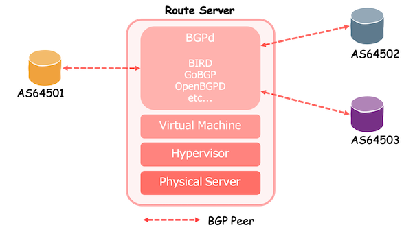
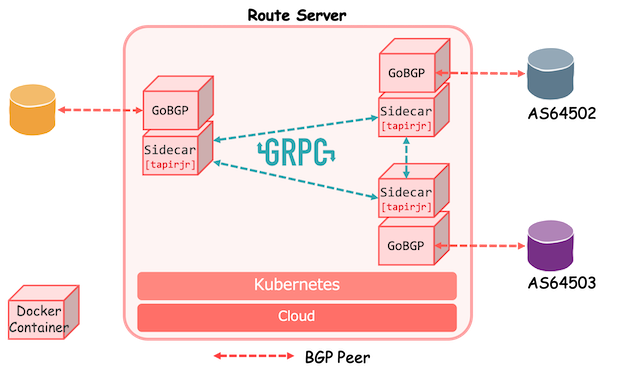

# tapirjr: Sidecar for GoBGP Route Server

A conceptual sidecar application for GoBGP to build Cloud Native Route Server.

## Concept
### Typical Virtualized Route Server

### Cloud Native Route Server with tapirjr

## Compatibility
This application is not ready for production use yet. 
Current status of compatibility with [RFC7947](https://tools.ietf.org/html/rfc7947) is here.

| Function | | Check |
| --- | --- | --- |
| Attribute Transparency | NEXT_HOP | true | 
| | MED | true |
| | AS_PATH | false (will work) |
| | Communities | true | 
| Mitigation of Path Hiding | - | false (working) |

## Development
### ToDo
Following tasks are in progress.
* Basics
    * Retry connection
    * Tracking RIB for newly added peer
    * Structured log
* Route Server Functions
    * Communities based filtering
* Continuously Integration
    * Add test
    * Introduce CI tools
    * Automated docker image build
* Advance
    * Introduce Kubernetes

## Play
See [Playgroud](playground/playground.md).